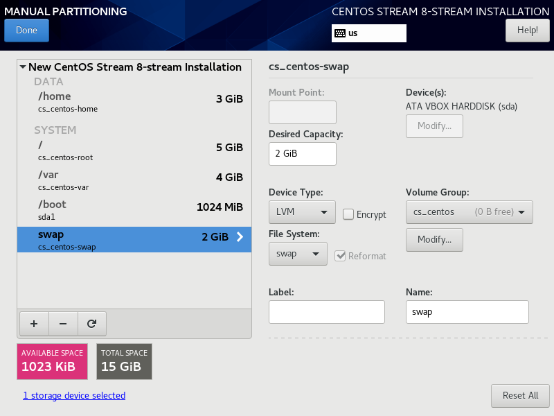
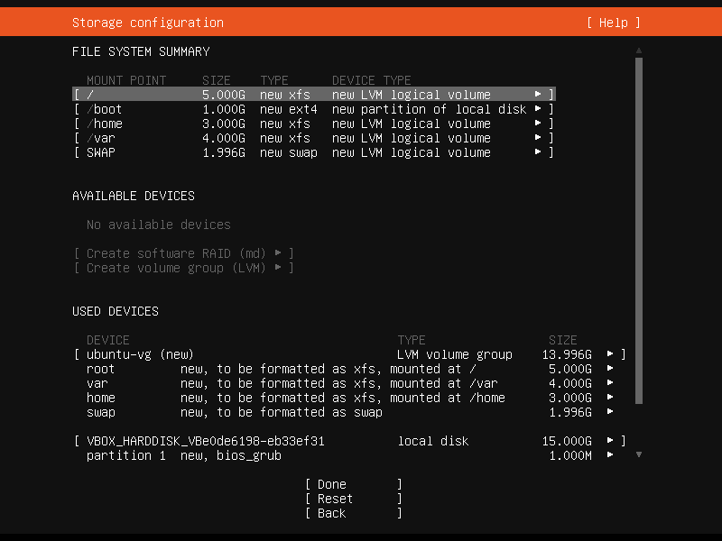

# Obligatorio Taller ASL 2021
Repositorio creado para el Obligatorio de Taller ASL, el cual se va a utilizar para trabajar de forma simultanea entre los integrantes del grupo para aprobar la materia Taller de Administracion de Servidores Linux.
El obligatorio consiste en implementar una solucion para automatizar tareas con la herramienta [Ansible](https://www.ansible.com/), teniendo un servidor como bastion (controlador), luego desde este se van a crear playbooks para la automatizacion en 2 servidores con OS Linux, con las distribuciones [CentOS](https://www.centos.org/) y [Ubuntu](https://ubuntu.com/).

# Declaracion de autoría
Nosotros: Carlos Marval, Juan Pablo Trinchitella; estudiantes de la [Universidad ORT Uruguay](https://www.ort.edu.uy/), en la Facultad de Ingeniería de la carrera [Analista en Infraestructura Informática](https://fi.ort.edu.uy/analista-en-infraestructura-informatica), declaramos que la solución propuesta del presente obligatorio es auténtica, original y que se han citado las fuentes correspondientes en cuanto a información complementaria se refiere.

Por ende; las ideas, resultados y las conclusiones a las que hemos llegado son de nuestra absoluta responsabilidad.

El contenido y la propiedad intelectual de la solución presentada, nos corresponde única y exclusivamente a los integrantes del presente grupo.

                
                [Carlos A. Marval]()                                              [Juan Pablo Trinchitella](https://www.linkedin.com/in/juan-pablo-trinchitella)

# Introducción
---

## Servidor CentOS
---
### Instalacion
---
#### Particionado de discos
De esta manera se realiza el particionado


#### Actualizacion de paquetes
---
- Actualizacion de paquetes
```bash
sudo dnf upgrade

```


## Servidor Ubuntu
---
### Instalacion
---
#### Particionado de discos
De esta manera se realiza el particionado


## Servidor Ansible
---
### Instalacion
---
#### Actualizacion de paquetes
---
- Actualizacion de paquetes
```bash
sudo dnf upgrade

```

#### Creacion de clave publica y privada
---
- Crear el par de claves
```bash
ssh-keygen

```
- Copiar el contenido de la clave publica y agregarla al usuario de GitHub con el mail correspondiente

- Copiar la clave publica en los diferentes servidores el cual se va a conectar el controlador
```bash
ssh-copy-id ansible@DireccioIP

```
- Ejecutar los siguientes comandos, para que los servidores no pidan contraseña cada vez que se corra un playbook en Ansible
```bash
eval $(ssh-agent)

ssh-add

```

#### Instalacion de paquetes
---
- Instalar repositorio EPEL
```bash
sudo dnf install epel-release -y

```
- Descarga y almacena en caché metadatos para repositorios habilitados 
```bash
sudo dnf makecache

```
- Instalar el paquete Git
```bash
sudo dnf install git -y

```

- Instalar Ansible
```bash
sudo dnf install ansible -y

```

#### Prueba de funcionamienta de Ansible
---
- Realizamos prueba de funcionamiento hacia otro servidor
```bash
ansible -i IP_HOST_A,IP_HOST_B, all -m ping

```
- Vemos la configuracion de cada servidor
```bash
ansible -i IP_HOST_A,IP_HOST_B, all -m setup

```

#### Estructura de Ansible
---
- Estructura de directorios Ansible
```bash
ansible.cfg
├── group_vars
│   ├── all
│   ├── centos
│   ├── dbservers
│   └── ubuntu
├── img
│   ├── CentOS_Particionado.png
│   └── Ubuntu_Particionado.png
├── inventario
├── LICENSE
├── README.md
├── roles
│   ├── common
│   │   ├── handlers
│   │   │   └── main.yml
│   │   ├── tasks
│   │   │   ├── centos.yml
│   │   │   ├── main.yml
│   │   │   └── ubuntu.yml
│   │   └── templates
│   │       ├── chrony.conf.j2
│   │       └── ntp.conf.j2
│   ├── db
│   │   ├── handlers
│   │   │   └── main.yml
│   │   ├── tasks
│   │   │   ├── centos.yml
│   │   │   ├── main.yml
│   │   │   └── ubuntu.yml
│   │   └── templates
│   │       └── my.cnf.j2
│   └── web
│       ├── tasks
│       │   ├── copy_code.yml
│       │   ├── install_httpd.yml
│       │   └── main.yml
│       └── templates
│           └── index.php.j2
└── site.ymlmp/

```

---

## License
[GPLv3.0](https://www.gnu.org/licenses/gpl-3.0.html)
